# Secure Development With Docker &mdash; DockerCon 2023 workshop

<details><summary><h2>Setup the workshop platform</h2></summary>

### Requirements

- git
- Docker Desktop 4.24.0 or greater
- Docker Hub account `$ORG`

Docker Desktop must be configured to use containerd.  In Docker Desktop, go to
the Settings (⚙️ icon) &gt; Features in development and make sure the box next
to "Use containerd for pulling and storing images". If you changed the setting,
click the "Apply & Restart" button.

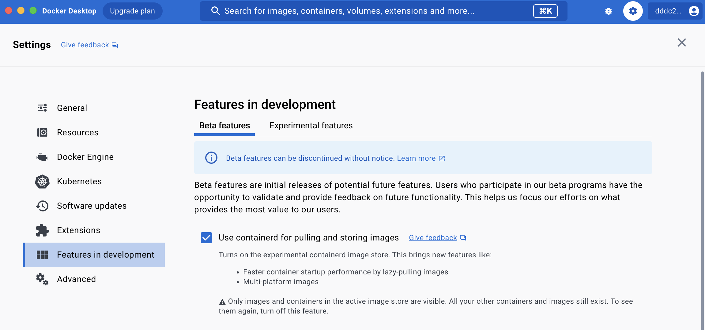

### Prerequisites

> *Conventions:*
> `$ORG` is the name of the Docker Hub account you will use.
> It can be a personal or a team one. Better if you have full ownership on it.

1. Clone the repository on your local machine
2. (optional) export `ORG` environment variable so you can more easily copy/paste commands

   ```console
   export ORG=<your organization namespace>
   ```
3. Configure organization for Docker Scout

   ```console
   docker scout config organization $ORG
   ```
4. Copy `env.dist` file to `.env`
5. Edit `.env` and set `NAMESPACE` to `$ORG`
6. Enroll your organization to Docker Scout

   ```console
   docker scout enroll $ORG
   ```
7. Checkout Hands-On #1

   ```console
   git checkout hands-on-1
   ```
8. Build demo images

   ```console
   docker compose --profile images build
   ```

   > This command will build two images we will explore.
   > To know more about how they are built look at
   > [`./docker-compose.yml`](./docker-compose.yml) and
   > [`./backend/Dockerfile`](./backend/Dockerfile) that
   > contains the build definitions.

   > In case of network issues, you can also build the following
   > image that is prebuilt and don't need extra dependencies.

   ```console
   docker compose --profile low_network build
   ```
</details>

<details><summary><h2>Hands-on #1: Remediating vulnerabilities</h2></summary>

### Reset git repository

```console
git reset --hard hands-on-1
```

### Base Image Fix (Docker Desktop)

1. Open Docker Desktop and select the image `$ORG/scout-demo-service:v1`

   
2. Take the time to explore the different information displayed on this page

   - Image hierarchy, layers and the Images tab
   - Vulnerabilities
   - Packages

3. Select your base image and explore vulnerabilities specific to the base image.
   Then select "Recommendations for base image…" in the "Recommended fixes"
   dropdown in the upper right portion of the window.

   

4. Select _Change base image_ and set the current image to 3.14

   

5. Open [`frontend/Dockerfile`](./frontend/Dockerfile) in your favorite file editor
   and apply the "Tag is preferred tag" recommendation, i.e., change the `FROM` line to

   ```dockerfile
   FROM alpine:3.18
   ```

6. (optional) Update the tag to `v2` in [`docker-compose.yml`](./docker-compose.yml)
7. Rebuild the image

   ```console
   docker compose --profile scout-demo-service build
   ```
8. Open the image inside Desktop and see the impact of your change

   

### Base Image Fix (Docker Scout CLI)

1. Run `docker scout cves` command against the image you just built:

   ```console
   docker scout cves $ORG/scout-demo-service:v1
   ```

   
2. (optional) Explore the filters options from `docker scout cves` command
3. (optional) See vulnerable packages only

   ```console
   docker scout cves --format only-packages --only-vuln-packages $ORG/scout-demo-service:v1
   ```

   

4. Explore base image recommendations using `docker scout recommendations`

   -> specify the tag upfront, like we selected it in Docker Desktop

   ```console
   docker scout recommendations --tag 3.14 $ORG/scout-demo-service:v1
   ```

   

5. Apply the "Tag is preferred tag" recommendation to the [`frontend/Dockerfile`](./frontend/Dockerfile)
6. (optional) Update the tag to `v2` in [`docker-compose.yml`](./docker-compose.yml)
7. Rebuild the image

   ```console
   docker compose --profile scout-demo-service build
   ```
8. Run `docker scout cves` command against the image you just built and see the changes:

   ```console
   docker scout cves $ORG/scout-demo-service:v2
   ```

   
9. Compare the two images to see the differences:

   ```console
   docker scout compare $ORG/scout-demo-service:v2 --to $ORG/scout-demo-service:v1
   ```

   

### Application Dependency Fix

1. Explore the still existing vulnerabilities: (Desktop or CLI)
   - find vulnerable package
   - find fix version
2. Update [`package.json`](./frontend/package.json) to upgrade the dependency
3. (optional) Update the tag to `v3` in [`docker-compose.yml`](./docker-compose.yml)
4. Rebuild the image
5. Explore the built image to see what changed
   - using Desktop
   - using CLI

### Extra Command

1. Get a quick overview of your image, including vulnerabilities and recommendations

   ```console
   docker scout quickview $ORG/scout-demo-service:v1
   ```

### Extra Image

Repeat the above steps for the `$ORG/scout-demo-service-back:v1` image (or any other image you have).

</details>

<details><summary><h2>Hand-on #2: Using Docker Scout to connect your data model</h2></summary>

### Reset git repository

```console
git reset --hard hands-on-2
```

### Registry - https://scout.docker.com Integration

#### Create repositories

Go to https://hub.docker.com and create repositories for the images you will push

- `$ORG/scout-demo-service`
- `$ORG/scout-demo-service-back`

#### Enable repositories for Docker Scout

_Option 1: Use Docker Scout Dashboard_

1. Go to https://scout.docker.com
2. Select your organization in the dropdown next to your user
3. Open the settings menu (⚙️ icon) and select _Repository settings_
4. Select the repository to enable and enable it

_Option 2: Docker Hub Integration using the CLI_

```console
docker scout repo enable $ORG/scout-demo-service
```

```console
docker scout repo enable $ORG/scout-demo-service-back
```

### Push images

1. Push an image to Hub

   ```console
   docker push $ORG/scout-demo-service:v1
   ```

2. Browse https://scout.docker.com and see your images (this might take up to a few minutes)

   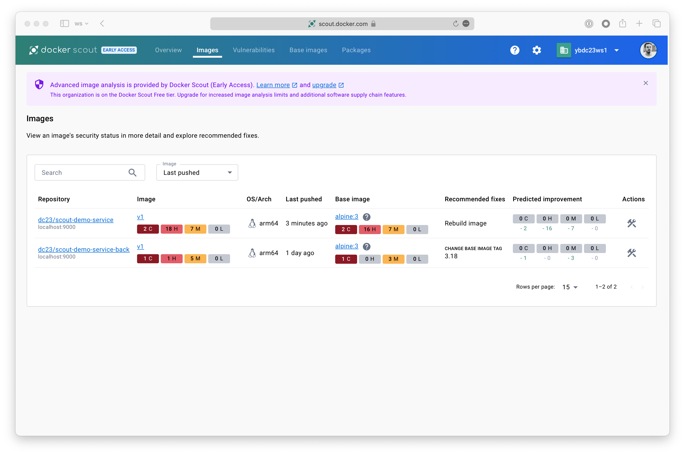

### Analyze images

Reproduce the exploratory steps from _Hands-on #1_ on https://scout.docker.com.
Find vulnerabilities, package information and compare your images.

You can build and push the different versions of the images you previously built (with vulnerabilities or with fixes).
Or simply push the fixes you built in the first hands-on exercise.

```console
docker push $ORG/scout-demo-service:v3
```

### Record images to an environment

1. Record the image to an environment (adapt to your registry)

   ```console
   docker scout environment staging registry://$ORG/scout-demo-service:v1
   ```

   This will explicitly record the image that has been pushed to a registry, to the environment `staging`.

   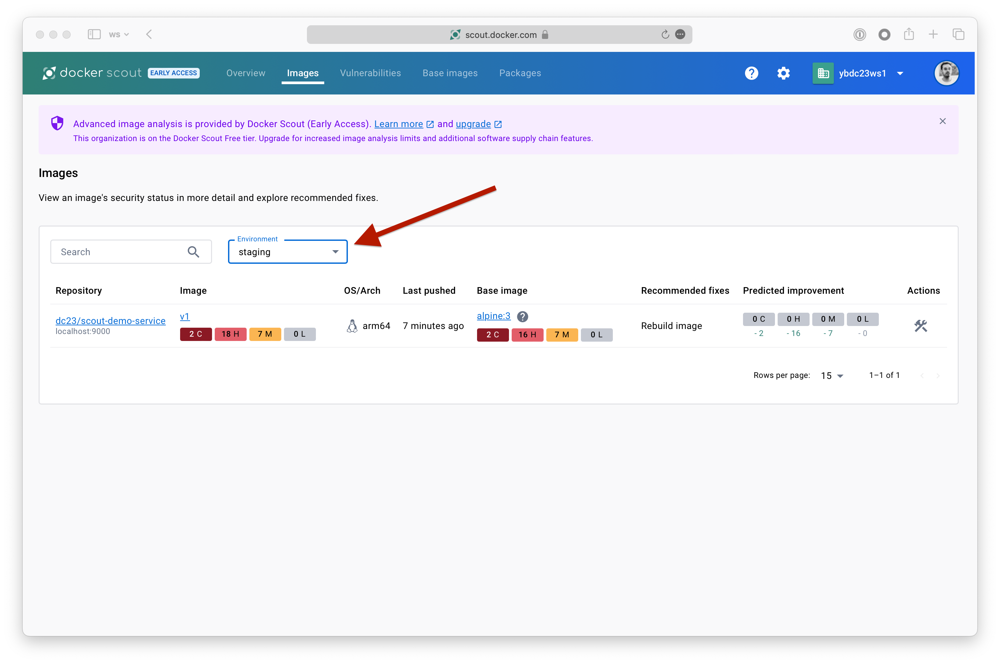

2. Investigate environment information from the CLI

   ```console
   docker scout environment
   ```

   ```console
   docker scout environment staging
   ```

3. Compare your fixed local image to the one recorded as part of the `staging` environment

   ```console
   docker scout compare local://$ORG/scout-demo-service:v3 --to-env staging
   ```

   
4. Browse https://scout.docker.com

   - find images recorded to an environment
   - find vulnerabilities and packages in an environment
   - compare images between versions and/or environments

   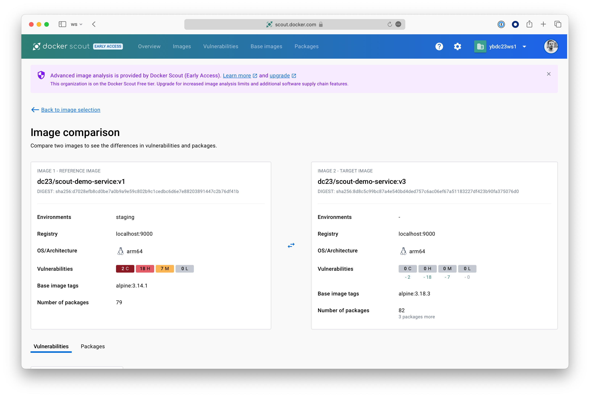

5. Record `v3` to the staging environment

   ```console
   docker scout environment staging registry://$ORG/scout-demo-service:v3
   ```

6. Verify you have no vulnerabilities in `staging` at https://scout.docker.com &gt;
   Vulnerabilities and select the staging environment

7. Browse available integrations on https://scout.docker.com &gt;
   Settings (⚙️ icon) &gt; Integrations

</details>

<details><summary><h2>Hand-on #3: Explore & add provenance & SBOMs using Buildkit & Docker Scout</h2></summary>

### Reset git repository

```console
git reset --hard hands-on-3
```

### Provenance Attestation

Remember the `--tag` flag when we explore the base image recommendations or the dropdown to pick
the right one in the UI?

```console
docker scout recommendations --tag 3.14 $ORG/scout-demo-service:v1
```

This tag was needed because the base image exists under different tag (`latest`, `3`, `3.14` at least)
and the information contained in the image are not sufficient to pick the right one.

So let's fix that.

1. We have added a new command to the _end_ of the [`frontend/Dockerfile`](frontend/Dockerfile)
   so it gets rebuilt, but quickly

   ```dockerfile
   ENV DUMMY=1
   ```

   (this line was introduced when you reset to the `hands-on-3` tag above)
2. Build a new image with the _provenance_ attestation

   ```console
   ( cd frontend && \
     docker build -t $ORG/scout-demo-service:provenance \
       --provenance=mode=max --push . )
   ```
3. Get recommendations about the image that has been pushed

   ```console
   docker scout recommendations registry://$ORG/scout-demo-service:provenance
   ```

   This time you didn't provided the `--tag` and it picked the right one!

   > Base image is `alpine:3.14`

4. How did it do that? Let's look at the provenance.

   ```console
   docker buildx imagetools inspect $ORG/scout-demo-service:provenance \
     --format '{{ json .Provenance.SLSA }}'
   ```

   (note we are extracting an element called `SLSA`!)
   That is a lot of information. Let's focus on information about the base image.
   One place to see that is in the first element of the `llbDefinition` array:

   ```console
   docker buildx imagetools inspect $ORG/scout-demo-service:provenance \
     --format '{{ json .Provenance.SLSA }}' | jq '.buildConfig.llbDefinition[0]'
   ```

   (requires the [`jq`](https://jqlang.github.io/jq/) command)
   See how the identifier has the exact SHA used as the base image?

> **Note on `push` and `registry://`**
>
> We need to access the provenance attestation from the image. It's written at the level
> of the _Image Index_ (same as for multi-arch images). The local Docker daemon doesn't allow
> currently to easily access those information.
>
> But they are available from registries. So when pushed, all these extra information will
> be available and CLI or https://scout.docker.com tools will be able to use them.

### SBOM

When an image is used on the CLI or pushed to https://scout.docker.com one of the first
steps is to index it. It means to go through the image and find all the packages for instance.

It also means this action might be performed multiple times, like if we want to see
the vulnerabilities of the image from different computers.

But it's possible to generate SBOM at the build time and push it along with the image.
That way, whatever the size of the initial image, we will only require the SBOM (enhanced
with provenance if available) and it will make all the CLI actions faster and be sure
the information displayed on https://scout.docker.com are the right ones.

1. Change the value of the environment variable at the end of [`frontend/Dockerfile`](frontend/Dockerfile)
   so the image gets rebuilt and pushed, quickly

   ```dockerfile
   ENV DUMMY=2
   ```

2. Build a new image with an _SBOM_ attestation (and keep the provenance!)

   ```console
   ( cd frontend && \
     docker build -t $ORG/scout-demo-service:attests \
       --sbom=generator=docker/scout-sbom-indexer \
       --provenance=mode=max --push . )
   ```
3. Run any `docker scout` CLI command, e.g.,

   ```
   docker scout quickview $ORG/scout-demo-service:attests
   ```

   and you should see:

   > ✓ Provenance obtained from attestation
   > ✓ SBOM obtained from attestation, 79 packages indexed

   This means we only get the SBOM from the attestation, and we are not indexing locally
   the image anymore. It's faster and more accurate.

### Explore SBOM

1. Extract the SBOM in `SPDX` format:

   ```console
   docker scout sbom --format spdx registry://$ORG/scout-demo-service:attests
   ```

   That is a lot of process. Let's look at some more useful format options.
2. Display packages of the image:

   ```console
   docker scout sbom --format list registry://$ORG/scout-demo-service:attests
   ```

   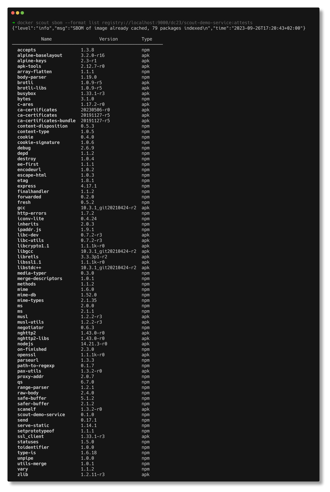
3. Display vulnerable packages:

   ```console
   docker scout cves --format only-packages --only-vuln-packages registry://$ORG/scout-demo-service:attests
   ```

   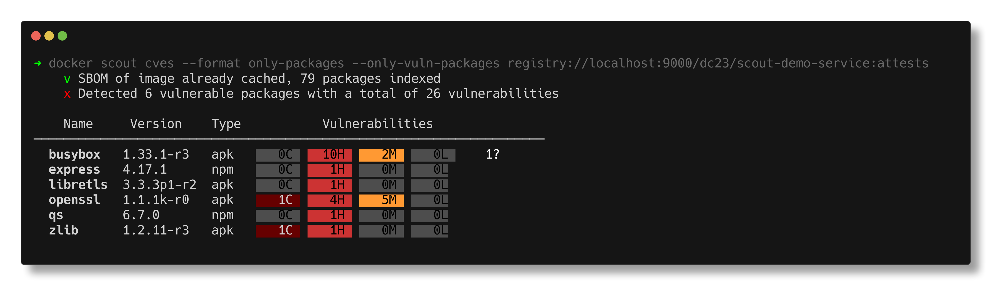

</details>

## Hands-on #4: Getting back into compliance with Docker Scout

### Reset git repository

```console
git reset --hard hands-on-4
```

### Explore policy

Up to now, we've focused on single images. Now let's see how policy highlights
concerns across all our images.

1. Build and push both images in the app.

   ```console
   ( cd frontend && \
     docker build -t $ORG/scout-demo-service:4 \
       --sbom=generator=docker/scout-sbom-indexer \
       --provenance=mode=max --push . )
   ```

   ```console
   ( cd backend && \
     docker build -t $ORG/scout-demo-service-back:4 \
       --sbom=generator=docker/scout-sbom-indexer \
       --provenance=mode=max --push . )
   ```

2. View policy status for a single image using the CLI

   ```console
   docker scout policy $ORG/scout-demo-service-back:4
   ```

   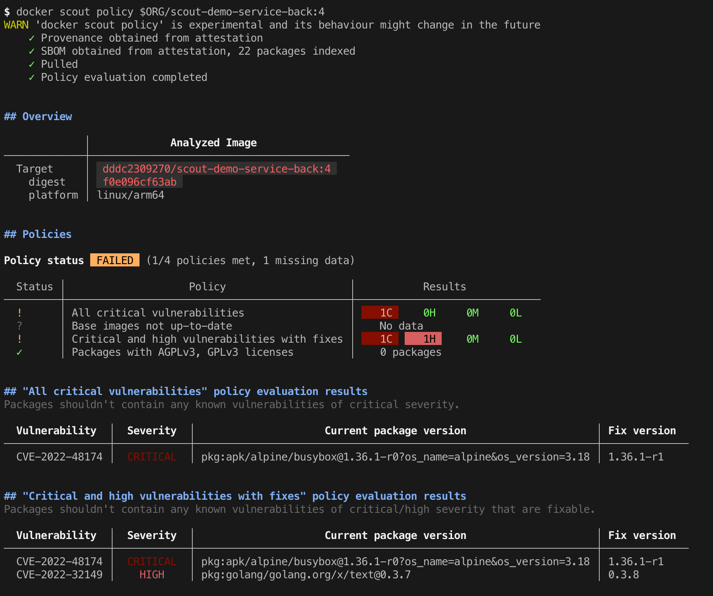

3. Go to https://scout.docker.com and click on "Policies EA" at the top

   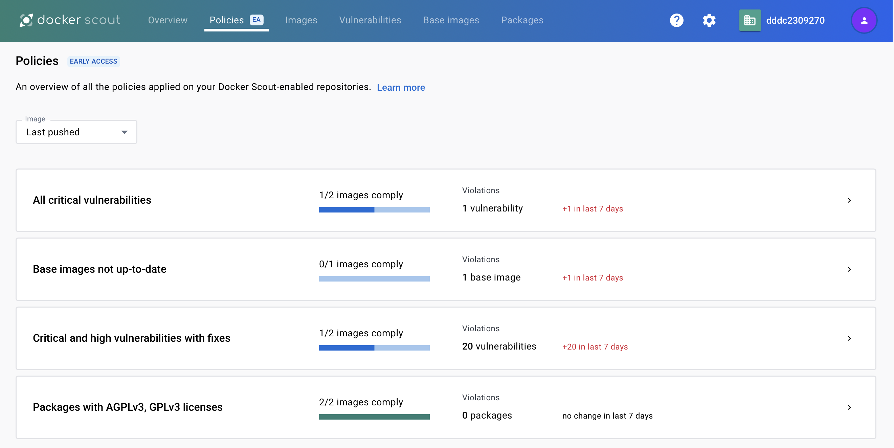

4. Explore the "Critical and high vulnerabilities with fixes" policy and view the details
   on the `$ORG/scout-demo-service`

### Improve policy compliance

1. From looking through the layers before, we know how to fix that. Let's update the base image
   in [`frontend/Dockerfile`](frontend/Dockerfile):

   ```dockerfile
   FROM alpine:3.18
   ```

2. Now rebuild, incrementing the tag

   ```console
   ( cd frontend && \
     docker build -t $ORG/scout-demo-service:4.1 \
       --sbom=generator=docker/scout-sbom-indexer \
       --provenance=mode=max --load . )
   ```

3. Note we did not push the image in the previous step. Entirely locally, we can see if we have
   improve policy compliance using the `compare` command we used previously when focusing on
   fixing vulnerabilities

   ```console
   docker scout compare $ORG/scout-demo-service:4.1 --to $ORG/scout-demo-service:4
   ```

   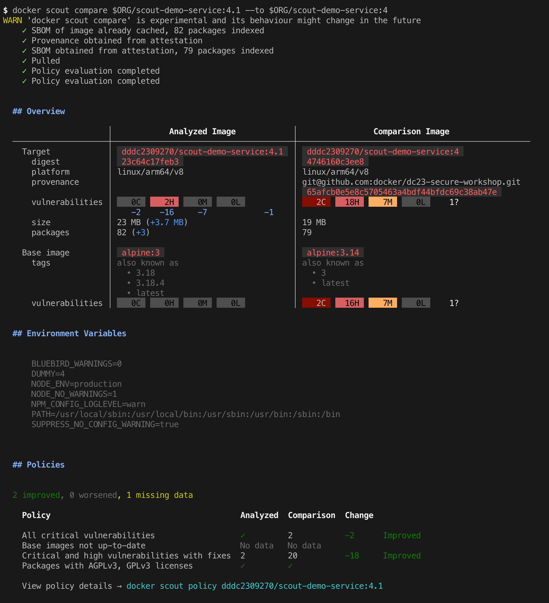
   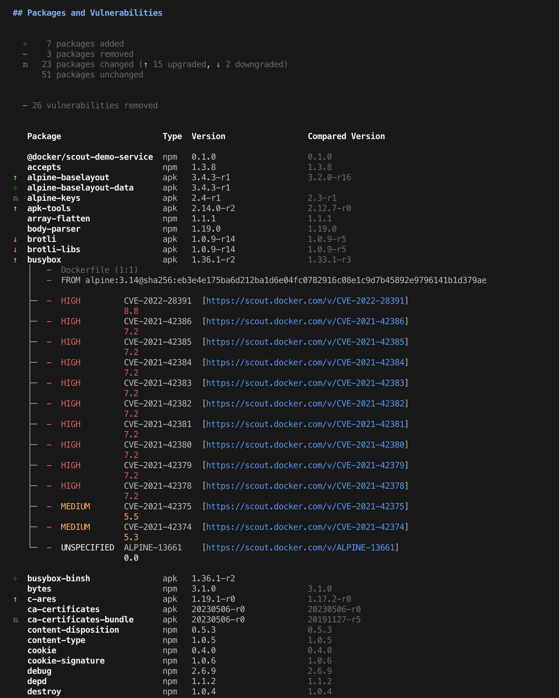

   Scrolling past the Overview to the Policies section of the output, you can see you improved
   two policies without pushing images or running CI.

4. We see from the above command that while we are now compliant with the "All critical
   vulnerabilities", we are still not in compliance with the "Critical and high
   vulnerabilities with fixes" policy, there are still two high vulnerabilities. From our first
   hands-on earlier today, we know how to fix that too. Update the express dependency in
   [`frontend/package.json`](frontend/package.json) to version 4.17.3 and rebuild the image.

   ```console
   ( cd frontend && \
     docker build -t $ORG/scout-demo-service:4.2 \
       --sbom=generator=docker/scout-sbom-indexer \
       --provenance=mode=max --load . )
   ```

5. Run the `compare` command again to see if we are fully compliant

   ```console
   docker scout compare $ORG/scout-demo-service:4.2 --to $ORG/scout-demo-service:4
   ```

6. That did the trick, so push the image

   ```console
   docker push $ORG/scout-demo-service:4.2
   ```

7. Go to https://scout.docker.com

   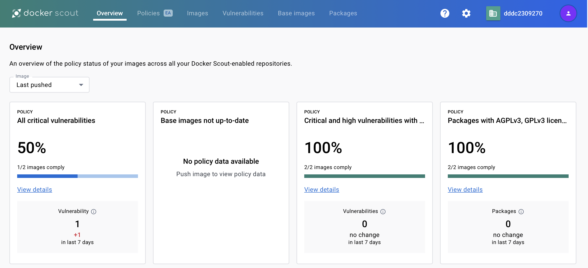

### Extra Image

Repeat the above steps for the `$ORG/scout-demo-service-back` image (or any other image you have).
